# SRE Agent Infra Repository – Contributor Guide

## 📌 Overview
이 리포지토리는 **Azure 기반 SRE Agent 플랫폼**의 인프라, 관측(Observability), CI/CD 통합을 위한 **Infrastructure as Code(IaC)** 및 운영 표준을 제공합니다.  
모든 작업은 **역할별 폴더 구조**를 기반으로 진행되며, 각 담당자는 지정된 영역의 모듈과 설정을 관리합니다.

---

## ✅ 역할 및 담당 범위

### 1. **Infrastructure & Platform Lead**
- **목표**: Azure AKS/네트워크/Ingress 등 핵심 인프라 리소스 구축 및 표준화
- **주요 작업**
  - AKS 클러스터 초기 구축 (**INFRA-001**)
  - 기본 Ingress 및 네트워킹 설정 (**INFRA-002**)
- **작업 폴더**
  ```
  infra/
  ├─ aks/                # AKS 클러스터 IaC (Bicep/Terraform)
  ├─ networking/         # VNet, Subnet, NSG, Ingress Controller
  ├─ storage/            # Azure Files, Blob, PVC 설정
  └─ policies/           # Azure Policy, RBAC, 보안 가드레일
  ```

---

### 2. **Observability & Monitoring Lead**
- **목표**: 로그, 메트릭, 트레이싱 기반의 관측 가능성 확보
- **주요 작업**
  - Loki 스택 설치 및 기본 로그 수집 (**OBS-001**)
  - Prometheus 메트릭 수집 설정 (**OBS-002**)
- **작업 폴더**
  ```
  observability/
  ├─ logging/            # Loki, Fluent Bit, Grafana 설정
  ├─ metrics/            # Prometheus, Alertmanager, Exporters
  ├─ tracing/            # OpenTelemetry Collector (옵션)
  └─ dashboards/         # Grafana 대시보드 JSON, Kusto 쿼리
  ```

---

### 3. **Integration & DevOps Lead**
- **목표**: GitHub Actions 기반 CI/CD 파이프라인 및 GitOps 전략 구현
- **주요 작업**
  - GitHub Actions CI/CD 파이프라인 기초 설정 (**DEVOPS-001**)
  - IaC 배포 워크플로 및 환경별 승격 전략 수립
- **작업 폴더**
  ```
  .github/workflows/     # GitHub Actions 워크플로 정의
  scripts/               # 배포 스크립트 (bootstrap, validate, deploy)
  gitops/                # ArgoCD/Flux 설정 (옵션)
  ```

---

## 🗂 리포지토리 구조 (Top-Level)
```
sre-agent-infra/
├─ README.md             # 본 가이드
├─ docs/                 # 아키텍처 다이어그램, ADR, 네이밍 규칙
├─ infra/                # 인프라(IaC) 모듈
├─ observability/        # 로그/메트릭/트레이싱 설정
├─ .github/workflows/    # CI/CD 파이프라인
└─ scripts/              # 자동화 스크립트
```

---

## 🔍 작업 방식
- **이슈 기반**: 모든 작업은 GitHub Issues(예: `INFRA-001`, `OBS-002`, `DEVOPS-001`)로 관리
- **브랜치 전략**: `feature/<issue-id>-<short-desc>` → PR → 리뷰 → main 병합
- **코드 리뷰**: 최소 1명 이상 승인 필수
- **문서화**: 변경 사항은 `docs/adr` 또는 관련 README에 기록

---

### 4. **High Level Design**

```mermaid
flowchart LR
  %% ========= Legend =========
  classDef azure fill:#eef6ff,stroke:#3388ff,stroke-width:1px,color:#0b4180
  classDef k8s fill:#f6ffef,stroke:#33a02c,stroke-width:1px,color:#225522
  classDef sec fill:#fff7e6,stroke:#f59e0b,stroke-width:1px,color:#7a4e00
  classDef cicd fill:#f3f4f6,stroke:#6b7280,stroke-width:1px,color:#111827
  classDef obs fill:#fff0f6,stroke:#d946ef,stroke-width:1px,color:#86198f
  classDef optional stroke-dasharray: 4 3

  %% ========= Azure Subscription & Resource Groups =========
  subgraph SUB["Azure Subscription"]
    direction TB

    subgraph RG_DEV["RG: sre-agent-dev-rg"]
    end
    subgraph RG_QA["RG: sre-agent-qa-rg"]
    end
    subgraph RG_PROD["RG: sre-agent-prod-rg"]
    end

    ACR[(Azure Container Registry)]:::azure
    KV[(Azure Key Vault)]:::sec
    AIF[(Azure AI Foundry / OpenAI 호환 API)]:::azure
    MON[(Azure Monitor / Log Analytics)]:::azure
    DEF[(Defender for Cloud & Policies)]:::sec
  end

  %% ========= Networking =========
  subgraph NET["Hub/Spoke VNet & Subnets"]
    direction TB
    VNET[(VNet + Subnets + NSG + UDR)]:::azure
    PDNS[(Private DNS Zones)]:::azure
  end

  %% ========= Ingress / Edge =========
  AGIC[(Ingress Controller\nNGINX or AGIC)]:::azure
  FTD[(Optional: Front Door / WAF)]:::azure-optional

  %% ========= AKS Cluster =========
  subgraph AKS["Azure Kubernetes Service (AKS)"]
    direction TB

    subgraph SYS_NS["kube-system & platform-ns"]
      CSI[(Secrets Store CSI Driver
         Azure Key Vault Provider)]:::sec
      CNI[(CNI/NetworkPolicy)]:::azure
      WI[(Workload Identity
         Managed Identity/OIDC)]:::sec
    end

    subgraph OPS_NS["ops-namespace (App Ops)"]
      OP(("Operator (Go)\n*다른 레포 배포 대상*")):::k8s
      SVC1[[ClusterIP/Service]]:::k8s
    end

    subgraph AGENT_NS["sre-agent-namespace (App)"]
      AG(("SRE Agent (Python)\n*다른 레포 배포 대상*")):::k8s
      SVC2[[ClusterIP/Service]]:::k8s
    end

    subgraph OBS_NS["observability-namespace"]
      LOKI[(Loki)]:::obs
      PROM[(Prometheus)]:::obs
      ALRT[(Alertmanager)]:::obs
      GRAF[(Grafana)]:::obs
      LOGFLT[(Promtail/Fluent Bit)]:::obs
    end
  end

  %% ========= CI/CD =========
  subgraph CICD["Integration & DevOps"]
    GH[(GitHub Actions\nOIDC Login to Azure)]:::cicd
    GITOPS[(Optional: GitOps)]:::cicd-optional
    SCRIPTS[(scripts/ bootstrap, deploy)]:::cicd
  end

  %% ========= Edges =========
  Internet(((Internet))):::cicd

  %% Ingress Path
  Internet -->|HTTPS| FTD
  FTD -. optional .-> AGIC
  Internet -->|HTTPS| AGIC
  AGIC -->|Ingress| SVC2
  AGIC -->|Ingress| SVC1

  %% AKS <-> ACR
  GH -->|build & push images| ACR
  AKS -->|pull images| ACR

  %% Secrets & Identity
  AKS -->|Workload Identity
     Managed Identity| KV
  CSI -->|mount secrets| OP
  CSI -->|mount secrets| AG

  %% Observability
  LOGFLT --> LOKI
  AKS -->|metrics scrape| PROM
  PROM --> ALRT
  LOKI --> GRAF
  PROM --> GRAF
  AKS --> MON

  %% CI/CD Deployment
  GH -->|IaC deploy  Bicep/Terraform | SUB
  GH -->|app manifests/Helm| AKS
  GITOPS -. reconcile .-> AKS
  SCRIPTS --> GH

  %% Operator ↔ Agent (in-cluster)
  OP -->|events/state| AG
  AG -->|status/decision| OP

  %% Agent ↔ LLM (outbound)
  AG -->|API call  Private Endpoint/Firewall | AIF

  %% Networking integration
  SUB --- NET
  AKS --- VNET
  KV --- PDNS
  ACR --- PDNS
  AIF --- PDNS

  %% Governance
  DEF --> SUB
```

